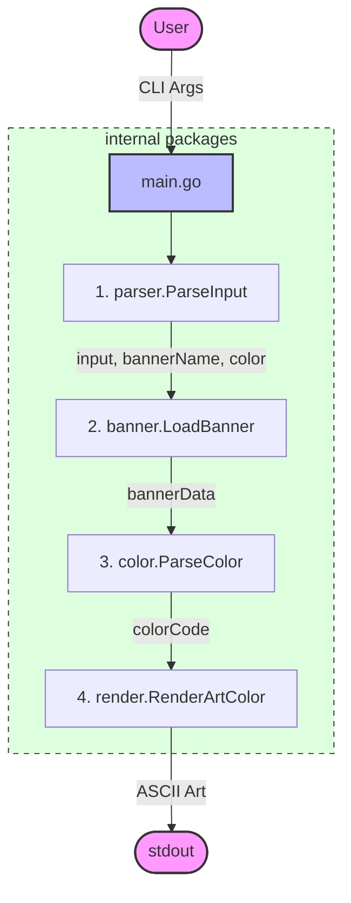

# Architecture Document

## ASCII-Art Generator v1.3 - Modular Design

### 1. System Overview

ASCII-Art is a command-line tool and library that transforms text strings into ASCII art using predefined banner templates and optional color output. The system follows a modular pipeline architecture with clear separation of concerns: Input Processing, Banner Loading, Color Handling, and Art Rendering.

### 2. Architectural Principles

- **Modularity:** Business logic in testable packages
- **Testability:** Unit tests for each component
- **Determinism:** Same input always produces same output
- **Isolation:** No external dependencies, standard library only
- **Fail-Fast:** Early validation, clear error messages

### 3. High-Level Architecture



### 4. Component Design

#### 4.1 Main Entry Point (main.go)

**Package:** `main`  
**Responsibility:** Thin orchestration layer

**Logic Flow:**

1. Call `parser.ParseInput()`
2. Handle invalid args → print usage
3. Handle empty input → silent exit
4. Resolve banner path (`banners/` + name + `.txt`)
5. Call `banner.LoadBanner(path)`
6. Handle errors → print error message
7. Call `render.RenderArtColor(input, banner, color, substring)`

#### 4.2 ParseInput Function (internal/parser/parse_input.go)

**Package:** `parser`  
**Signature:** `func ParseInput() (ParseResult, error)`

**Responsibility:** Validate and process command-line input. Supports optional color flag and banner.

**Algorithm:**

1. Validate argument format and optional `--color=` flag
2. Parse optional substring and banner
3. Replace literal `\\n` with actual `\n`
4. Return `ParseResult` with input, banner, and color fields

#### 4.3 LoadBanner Function (internal/banner/load_banner.go)

**Package:** `banner`  
**Signature:** `func LoadBanner(path string) ([]string, error)`

**Responsibility:** Load and parse banner file.

**Algorithm:**

1. Read file using `os.ReadFile`
2. Normalize line endings (Replace `\r\n` with `\n`)
3. Split by `\n` using `strings.Split`
4. Return string slice

#### 4.4 RenderArtColor Function (internal/render/render_art.go)

**Package:** `render`  
**Signature:** `func RenderArtColor(w io.Writer, input string, banner []string, colorStr string, colorSubstr string)`

**Responsibility:** Convert text to ASCII art and optionally apply color to output.

**Algorithm:**

1. Split input by `\n`
2. For each line segment:
   - If empty: print blank line
   - If not empty: call internal `printLine()`

### 5. File Structure

```
ascii-art/
├── asciiart/                # Public library package
│   └── asciiart.go
├── banners/                 # Banner templates (standard, shadow, thinkertoy)
│   ├── shadow.txt
│   ├── standard.txt
│   └── thinkertoy.txt
├── internal/                # Internal packages
│   ├── banner/
│   ├── color/
│   ├── parser/
│   └── render/
├── main.go                  # Entry point
├── go.mod                   # Module definition
├── docs/                    # Documentation
└── README.md                # Project overview
```

### 6. Banner File Format

- 1 empty line separator at start
- 9 lines per character (8 art lines + 1 separator)
- ASCII range 32-126 supported
- Index formula: `(ASCII_code - 32) * 9 + 1 + row`

### 7. Testing Strategy

- **Unit Tests:** `go test ./internal/...`
- **Manual Verification:** `go run . [STRING] [BANNER]` and `go run . --color=<color> [SUBSTRING] [STRING]`
- **Golden Tests:** 30 comprehensive cases for standard banner.
#### 4.5 Library API (asciiart/asciiart.go)

**Package:** `asciiart`  
**Signature:** `func RenderString(input string, opts Options) (string, error)`

**Responsibility:** Provide an importable API for rendering ASCII art strings with optional color and banner.
